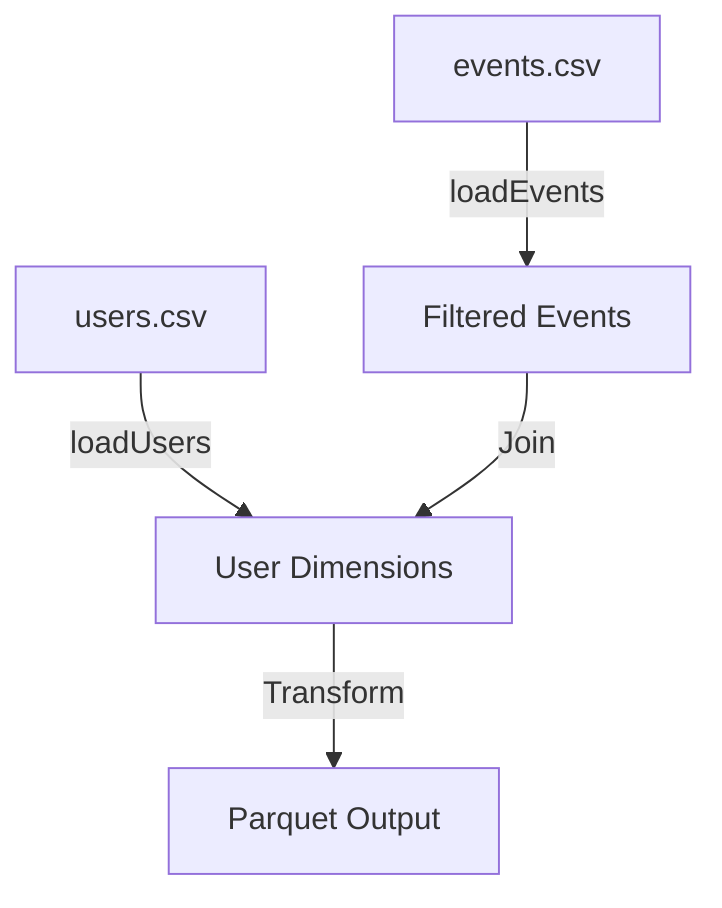
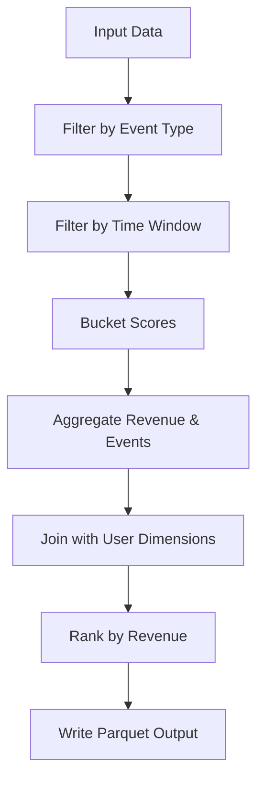

# UserMetricsJob Documentation

## Overview
This document provides comprehensive documentation for the `UserMetricsJob` class, which demonstrates common Spark patterns for data processing. The job reads data from CSV files, processes it using Spark transformations, and writes the output as a Parquet dataset.

## Key Features
- **SparkSession Configuration**: Adaptive Query Execution (AQE) and shuffle partitions.
- **Data Input**: Reads CSV files (`events.csv` and `users.csv`) with explicit schemas.
- **Data Processing**:
  - Filters data by event type and time window.
  - Buckets scores using either a UDF or built-in column expressions.
  - Aggregates user revenue and event counts.
  - Joins data with broadcast hints.
  - Applies window functions for ranking users by revenue per country.
- **Output**: Writes the processed data as a Parquet dataset.

## Inputs
- `events.csv`: Contains the columns `user_id`, `event_type`, `score`, `amount`, and `ts` (timestamp in ISO-8601 format).
- `users.csv`: Contains the columns `user_id` and `country`.

## Output
- A Parquet dataset with the following columns:
  - `country`
  - `user_id`
  - `revenue`
  - `event_count`
  - `score_bucket`
  - `country_rank`

## Code Structure
### Main Method
The main method initializes the Spark session, reads input arguments, and orchestrates the job execution. It includes error handling and logging to ensure robustness.

### Methods
#### `loadEvents`
Reads the `events.csv` file with an explicit schema and returns a `Dataset<Row>`.
- Schema:
  - `user_id`: String
  - `event_type`: String
  - `score`: Integer
  - `amount`: Double
  - `ts`: Timestamp

#### `loadUsers`
Reads the `users.csv` file with an explicit schema and returns a `Dataset<Row>`.
- Schema:
  - `user_id`: String
  - `country`: String

#### `transform`
Processes the input datasets and applies the following transformations:
1. Filters events by type and time window.
2. Buckets scores using either a UDF or built-in column expressions.
3. Aggregates user revenue and event counts.
4. Joins with user dimensions using a broadcast hint.
5. Applies a window function to rank users by revenue per country.
6. Ensures deterministic ordering for validation.

## Business Logic and Assumptions
- Events are filtered to include only `click` and `purchase` types.
- The time window for events is defined by `--from` and `--to` arguments.
- Score bucketing can be toggled between a UDF and built-in logic using the `--useUdf` argument.
- Revenue and event counts are aggregated per user.
- Users are ranked by revenue within each country.

## Risks and Migration Considerations
- Ensure that input data adheres to the expected schema.
- Validate the accuracy of score bucketing logic when switching between UDF and built-in expressions.
- Adjust Spark configuration parameters (e.g., shuffle partitions) for production-scale data.

## Diagrams
### Data Flow Diagram

### Transformation Steps

## Troubleshooting Guide
- **Issue**: Missing or malformed input data.
  - **Solution**: Validate input files and ensure they match the expected schema.
- **Issue**: Performance bottlenecks.
  - **Solution**: Optimize Spark configuration parameters (e.g., partitions, AQE).
- **Issue**: Incorrect score bucketing.
  - **Solution**: Verify the logic for both UDF and built-in expressions.

## Recommendations
- Regularly update documentation to reflect code changes.
- Integrate documentation generation into the CI/CD pipeline.
- Conduct peer reviews to ensure documentation accuracy and completeness.

## Conclusion
This documentation provides a detailed overview of the `UserMetricsJob` class, including its functionality, business logic, and implementation details. It serves as a comprehensive reference for developers and stakeholders involved in maintaining or migrating the codebase.
