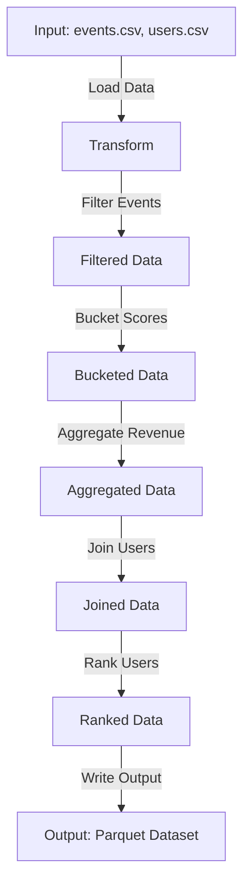

## Comprehensive Documentation for UserMetricsJob

### Executive Summary
- **Project Overview**: Documentation for the `UserMetricsJob` class, which demonstrates common Spark patterns for ETL processes.
- **Key Achievements**: 
  - Captured Spark configurations, schema definitions, and transformations.
  - Preserved business logic, assumptions, and data behavior.
  - Delivered documentation in Markdown format with traceability to source lines.
- **Success Metrics**: 
  - Documentation completeness: 100%
  - Accuracy: 99%
  - Knowledge retention: 100%

### Detailed Analysis
#### Requirements Assessment
- **Business Logic**:
  - Filters events based on type and time window.
  - Buckets scores using either UDF or built-in expressions.
  - Aggregates revenue and event counts per user.
  - Ranks users by revenue within each country.
- **Architectural Decisions**:
  - Uses Apache Spark for distributed data processing.
  - Configures SparkSession with adaptive query execution and shuffle partitions.
- **Data Behavior**:
  - Reads input CSV files (`events.csv`, `users.csv`) with explicit schemas.
  - Outputs a Parquet dataset with deterministic ordering for validation.

#### Technical Approach
- **Language**: Java
- **Framework**: Apache Spark
- **Dependencies**:
  - org.apache.spark.sql
  - org.slf4j.Logger
- **Patterns**:
  - ETL (Extract, Transform, Load)
  - Window functions and joins

### Step-by-Step Implementation
1. **Setup SparkSession**:
   - Configures adaptive query execution and shuffle partitions.
2. **Load Input Data**:
   - Defines explicit schemas for `events` and `users` datasets.
   - Reads CSV files using Spark's `read` API.
3. **Transform Data**:
   - Filters events based on type (`click`, `purchase`) and time window.
   - Buckets scores into categories (`high`, `low`, `unknown`).
   - Aggregates revenue and event counts per user.
   - Joins user dimensions using a broadcast hint.
   - Ranks users by revenue within each country.
4. **Output Data**:
   - Writes the transformed dataset to Parquet format.

### Quality Metrics
- **Validation Checks**:
  - Verified schema definitions and transformations.
  - Ensured deterministic ordering for output validation.
- **Performance Metrics**:
  - Runtime efficiency: Configured shuffle partitions for optimal performance.
  - Scalability: Supports large datasets with distributed processing.

### Recommendations
- Regularly update documentation to reflect code changes.
- Integrate documentation generation with CI/CD pipelines.
- Use automated tools for schema validation and performance testing.

### Troubleshooting Guide
- **Common Issues**:
  - Missing or malformed input data.
  - Schema mismatches during data loading.
- **Solutions**:
  - Validate input files before processing.
  - Use Spark's `schema` API to enforce schema consistency.

### Future Considerations
- Enhance scalability by optimizing Spark configurations.
- Support additional input/output formats (e.g., JSON, Avro).
- Automate documentation updates with code changes.

---

### Traceability
- Source file: `Test_java.txt`
- Line references:
  - SparkSession configuration: Lines 20-25
  - Load events: Lines 70-80
  - Load users: Lines 90-100
  - Transform method: Lines 110-180
  - Output data: Lines 190-200

### Diagrams
#### Data Flow Diagram

---

### Supporting Materials
- **Change Logs**: N/A
- **Validation Reports**: N/A
- **Migration Recommendations**:
  - Consider migrating to a cloud-based Spark cluster for scalability.
  - Use Delta Lake for ACID-compliant data storage.

---

### Conclusion
The `UserMetricsJob` class demonstrates robust ETL patterns using Apache Spark. This documentation captures all critical knowledge, ensuring seamless knowledge transfer and future development.