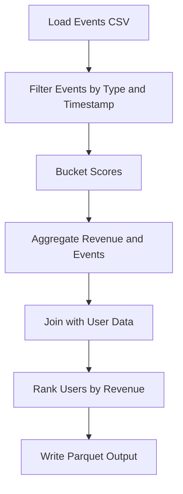
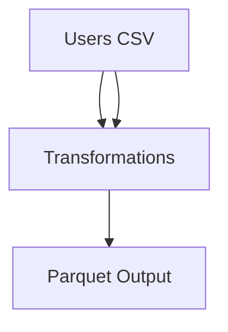

### UserMetricsJob Documentation

#### Overview
The `UserMetricsJob` is a Spark job designed to process CSV data files (`events.csv` and `users.csv`) and produce a Parquet dataset containing aggregated user metrics. It demonstrates key Spark patterns such as session configuration, reading CSV files with explicit schemas, filtering, UDF usage, joins, window functions, error handling, and deterministic output ordering.

#### Modules and Logic

1. **SparkSession Configuration**:
   - Adaptive Query Execution (AQE) enabled.
   - Shuffle partitions set to 8.

2. **Input Files**:
   - `events.csv`: Contains user events with columns `user_id`, `event_type`, `score`, `amount`, and `ts` (timestamp).
   - `users.csv`: Contains user demographic data with columns `user_id` and `country`.

3. **Transformations**:
   - Filter events by type (`click` and `purchase`) and timestamp window.
   - Bucket scores into categories (`unknown`, `high`, `medium`, `low`).
   - Aggregate revenue and event counts per user.
   - Join user data with events using a broadcast hint.
   - Rank users by revenue within each country.

4. **Output**:
   - Parquet dataset containing `country`, `user_id`, `revenue`, `event_count`, `score_bucket`, and `country_rank`.

#### Business Intent
The job aims to provide insights into user behavior and revenue generation by country. This data can be used for targeted marketing, revenue optimization, and performance analysis.

#### Assumptions
- Input files have headers and follow the specified schemas.
- Timestamps in `events.csv` are in ISO-8601 format.
- The job operates within a specified date window (`minDate` and `maxDate`).

#### Data Behavior
- Events are filtered to include only relevant types and timestamps.
- Scores are bucketed using either a UDF or built-in expressions.
- Revenue and event counts are aggregated per user.
- Users are ranked by revenue within their respective countries.

#### Implementation Guide
1. Configure SparkSession with AQE and shuffle partitions.
2. Load `events.csv` and `users.csv` using explicit schemas.
3. Apply transformations as described above.
4. Write the output to the specified Parquet path.

#### Quality Metrics
- Deterministic output ordering.
- Accurate bucketing and aggregation.
- Proper handling of null values and edge cases.

#### Recommendations
- Use built-in expressions for score bucketing unless UDFs are necessary.
- Validate input schemas and data types before processing.
- Optimize Spark configurations for large datasets.

#### Troubleshooting Guide
- **Issue**: Missing or incorrect input data.
  - **Solution**: Verify input file paths and schemas.
- **Issue**: Spark analysis errors.
  - **Solution**: Check transformation logic and Spark configurations.
- **Issue**: Unexpected output.
  - **Solution**: Validate intermediate datasets using `.show()`.

#### Diagrams

##### Data Flow Diagram


##### Architectural Diagram


#### Machine-Readable Index
```json
{
  "job_name": "UserMetricsJob",
  "inputs": [
    {"file_name": "events.csv", "columns": ["user_id", "event_type", "score", "amount", "ts"]},
    {"file_name": "users.csv", "columns": ["user_id", "country"]}
  ],
  "outputs": [
    {"file_name": "user_metrics_parquet", "columns": ["country", "user_id", "revenue", "event_count", "score_bucket", "country_rank"]}
  ],
  "transformations": [
    "Filter by event type and timestamp",
    "Bucket scores",
    "Aggregate revenue and events",
    "Join with user data",
    "Rank users by revenue"
  ]
}
```

#### Formats
- Markdown
- HTML (convert using external tools)
- PDF (convert using external tools)
