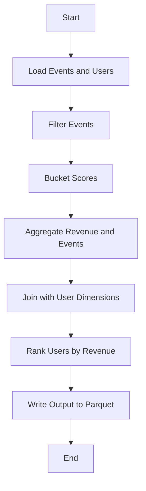
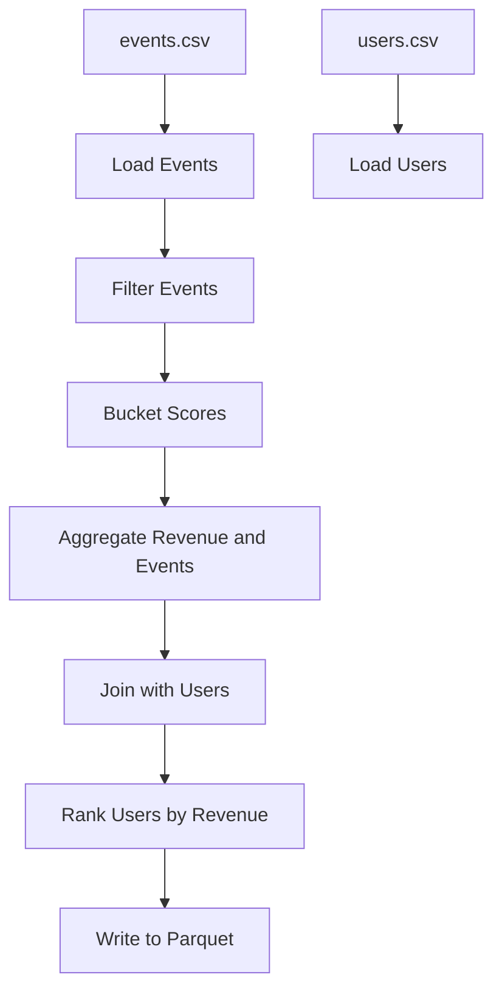

# UserMetricsJob Documentation

## Executive Summary
The `UserMetricsJob` is a Spark-based ETL job designed to process and analyze user metrics. It demonstrates common Spark patterns such as SparkSession configuration, reading CSV files, filtering data, using UDFs, performing joins, applying window functions, and writing output as a Parquet dataset. The job processes event and user data to generate a comprehensive report that includes user activity metrics, revenue aggregation, and ranking by country.

## Detailed Analysis
### Business Logic
1. **Input Data**:
   - `events.csv`: Contains event data with columns `user_id`, `event_type`, `score`, `amount`, and `ts` (timestamp).
   - `users.csv`: Contains user data with columns `user_id` and `country`.

2. **Processing Steps**:
   - Load event and user data from CSV files with explicit schemas.
   - Filter events based on type (`click` or `purchase`) and a specified time window.
   - Bucket user scores into categories (`high`, `medium`, `low`, `unknown`) using either a UDF or built-in logic.
   - Aggregate user revenue and event counts.
   - Join aggregated data with user dimensions (broadcast join for optimization).
   - Rank users by revenue within each country using window functions.
   - Write the final dataset to a Parquet file for downstream consumption.

3. **Output Data**:
   - A Parquet dataset containing the following columns: `country`, `user_id`, `revenue`, `event_count`, `score_bucket`, and `country_rank`.

### Assumptions
- The input data is clean and adheres to the specified schema.
- The `users.csv` file is small enough to fit into memory for a broadcast join.
- The time window for filtering events is specified in the correct format (ISO-8601).

### Data Behavior
- Events are filtered to include only `click` and `purchase` types within the specified time window.
- Scores are categorized into buckets for easier analysis.
- Revenue and event counts are aggregated at the user level.
- Users are ranked by revenue within each country.

## Step-by-Step Implementation Guide
1. Configure the `SparkSession` with adaptive query execution and shuffle partitions.
2. Load `events.csv` and `users.csv` with explicit schemas.
3. Filter events based on type and time window.
4. Bucket scores using either a UDF or built-in logic.
5. Aggregate revenue and event counts by user.
6. Perform a broadcast join with user dimensions.
7. Rank users by revenue within each country using window functions.
8. Write the final dataset to a Parquet file.

## Quality Metrics
- **Data Validation**: Ensure input data adheres to the specified schema.
- **Performance**: Optimize join operations using broadcast hints and reduce shuffle partitions.
- **Error Handling**: Log and handle exceptions during job execution.
- **Deterministic Output**: Use deterministic ordering for reproducibility.

## Recommendations
- Validate input data for schema compliance before processing.
- Monitor job performance and optimize configurations for large datasets.
- Test UDF and built-in score bucketing logic to ensure accuracy.
- Use partitioned Parquet files for better scalability in production.

## Troubleshooting Guide
- **Issue**: Spark analysis error.
  - **Solution**: Check the input data schema and ensure it matches the expected format.
- **Issue**: OutOfMemoryError during join operation.
  - **Solution**: Use broadcast join for small tables and increase executor memory.
- **Issue**: Incorrect output data.
  - **Solution**: Verify filtering criteria and score bucketing logic.

## Diagrams
### Logic Flow Diagram

### Data Flow Diagram

## Conclusion
The `UserMetricsJob` is a robust Spark ETL job that demonstrates best practices for data processing and analysis. By following the recommendations and troubleshooting guide, organizations can ensure successful implementation and scalability of this job.
