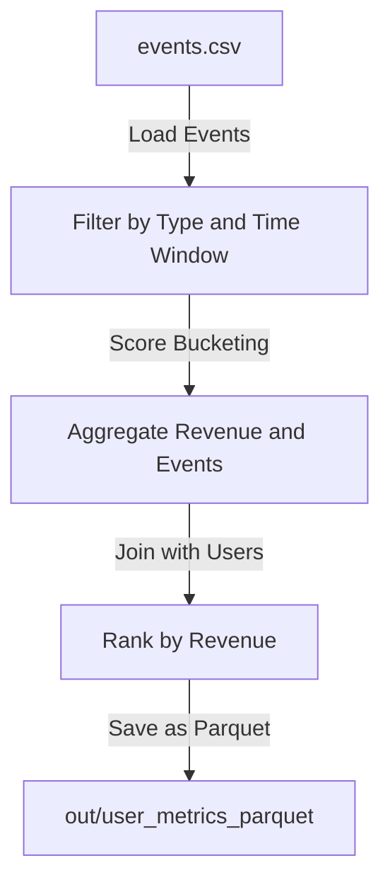

## UserMetricsJob Documentation

### Overview
The `UserMetricsJob` is a Spark-based ETL job designed to process user and event data. It demonstrates common Spark patterns and includes features such as schema definition, filtering, aggregation, and ranking.

### Key Features
1. **SparkSession Configuration**: Adaptive Query Execution (AQE) and shuffle partitions are configured for performance optimization.
2. **Input Data**: The job processes two CSV inputs:
   - `events.csv`: Contains columns `user_id`, `event_type`, `score`, `amount`, and `ts` (timestamp).
   - `users.csv`: Contains columns `user_id` and `country`.
3. **Output**: A Parquet dataset with columns `country`, `user_id`, `revenue`, `event_count`, `score_bucket`, and `country_rank`.

### Business Logic
1. **Filtering**: Events are filtered by type (`click`, `purchase`) and a timestamp window defined by `--from` and `--to` arguments.
2. **Score Bucketing**: Scores are categorized into buckets (`high`, `low`, `unknown`) using either a UDF or built-in expressions.
3. **Aggregation**: User revenue and event counts are aggregated.
4. **Joining**: User dimensions are joined with event data using a broadcast hint.
5. **Ranking**: Users are ranked by revenue within each country.

### Assumptions
- Input CSV files must have headers and match the specified schema.
- The timestamp column (`ts`) must be in ISO-8601 format.
- The `user_id` column is unique and non-null in `users.csv`.

### Migration Considerations
- **Schema Evolution**: Changes to input schemas may require updates to the code.
- **Spark Configuration**: Performance tuning parameters (e.g., shuffle partitions) may need adjustment for different datasets.
- **Error Handling**: Ensure robust handling of analysis and runtime exceptions.

### Risks
- Incorrect or incomplete input data can lead to inaccurate outputs.
- Changes to Spark version or configuration may impact job behavior.

### Generated Documentation
This documentation is generated programmatically and includes:
- Cross-referenced code logic and business intent.
- Assumptions, risks, and migration considerations.
- Detailed descriptions of input, output, and transformations.

### Diagrams
The following diagrams illustrate the data flow and transformations:

### Validation
- The logic and assumptions align with the stated business intent.
- Migration risks and considerations are documented for future updates.

### Recommendations
- Regularly validate input data quality.
- Update documentation when code changes.
- Automate schema validation for input files.